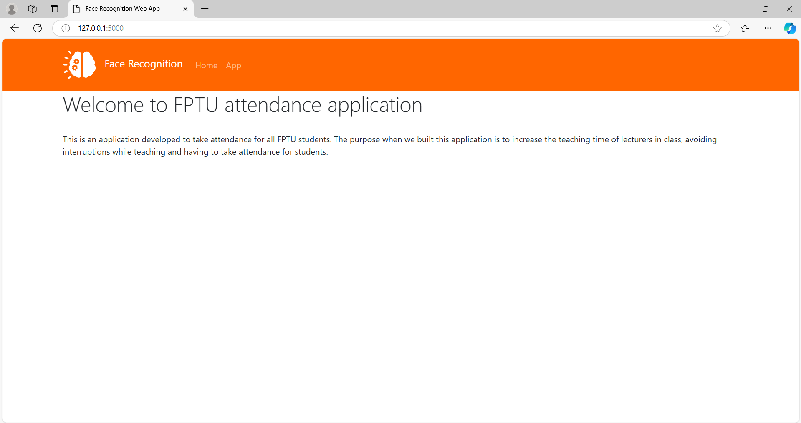
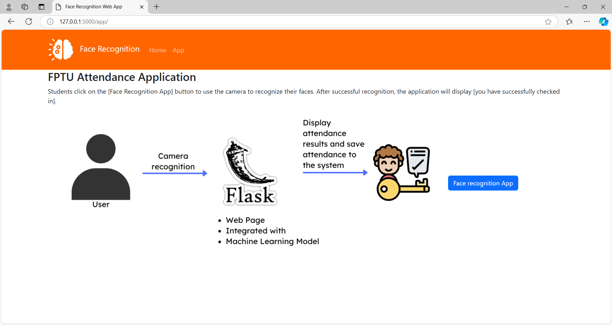
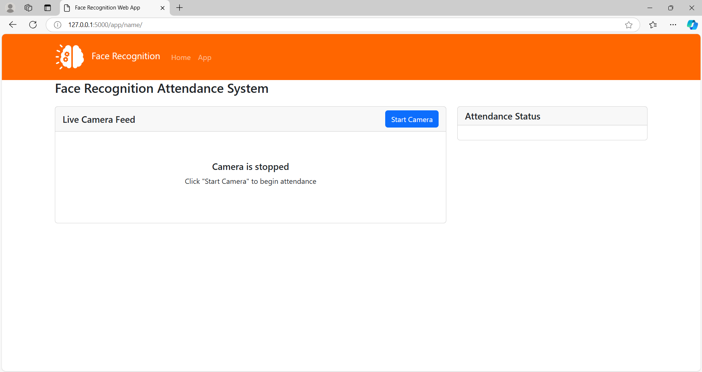
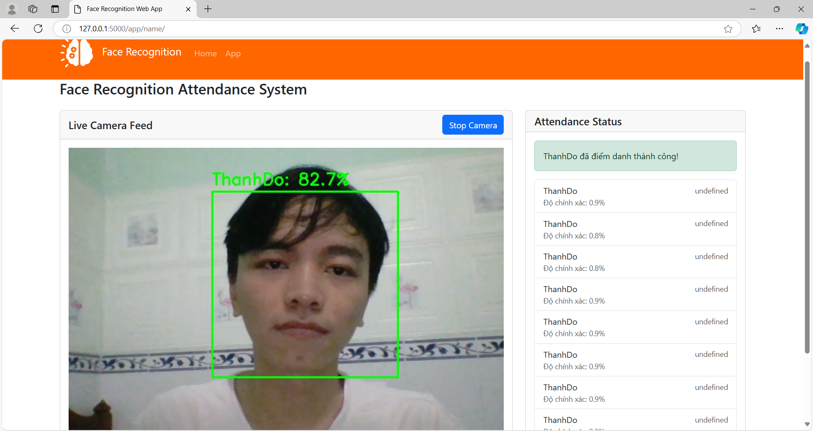
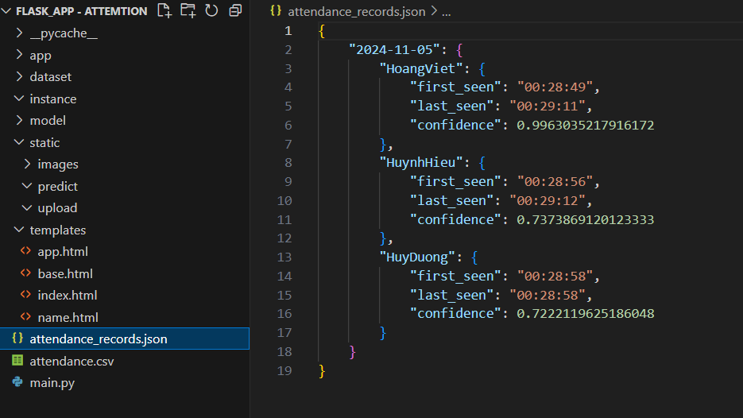

# Welcome to the FPTU Attendance Application

Taking attendance can be time-consuming and often disrupts the teaching and learning process for both students and lecturers. To address this, we propose an automated attendance solution using facial recognition technology, aiming to streamline attendance taking within the school environment. 

Our application is designed to bring convenience and efficiency, enhancing the overall effectiveness of teaching and learning.

---

## 1. Application Overview

This application leverages **machine learning** algorithms to enable facial recognition for attendance. The key algorithms used in building this model include:

- **Haar Cascade**: For face detection.
- **PCA (Principal Component Analysis)**: For feature extraction.
- **SVM (Support Vector Machine)**: For classification.

These foundational algorithms combine to create a reliable and efficient face recognition model.

---

## 2. Steps to Get Started

### Step 01: Clone the Repository

To get started, copy the command below and paste it into your terminal to download the project files to your computer:

```bash
git clone https://github.com/dolami2876/FPTU-attendance-application-using-PCA-and-SVM.git

```
### Step 02: Data Update Instructions

1. **Open the `Train_Face_With_ML` Folder**:
   Navigate to the `Train_Face_With_ML` folder where the training scripts and resources are located.

2. **Updating the Dataset**:
   - If your data is in **video format**, place it in the following directory:
     ```plaintext
     data/video_data
     ```
   - If your data is in **image format**, place it in the following directory:
     ```plaintext
     data/image_data
     ```

Make sure to organize your data correctly based on its format to ensure compatibility with the training scripts.
### Step 03: Run the Processing Scripts

After updating the data into the appropriate folders, follow the steps below to process and train the model. Run each script in the specified order:

1. **[crop_face]** this script crops faces from the input data to focus only on facial features.
2. **[resize]** resize the cropped images to a standard size for consistent processing.
3. **[eigen_face]** apply PCA (Principal Component Analysis) to extract essential facial features.
4. **[face_ML]** train the machine learning model (SVM) with the extracted features.
5. **[make_face]** use this script to test the trained model and print out the results before deploying it.

> **Note**: Ensure that each step completes successfully before moving on to the next.

Following these steps will set up your model for automatic attendance tracking.

### Step 04: Model Integration

Once you have successfully trained your model and completed the previous steps, you need to integrate the trained model into your Flask application for attendance tracking. Follow the instructions below:

1. **Locate the Trained Model**:
   navigate to the directory where your trained model files are stored, specifically at

   ```plaintext
   Flask_App - attemtion\Train_Face_With_ML\model
    ```
2. **Copy the Model Files**:
copy the entire contents of the model folder that contains your trained model files.
3. **Paste into the Application Directory**:
    paste the copied files into the following directory within your Flask application
   ```plaintext
   Flask_App - attemtion\model
   ```
### Step 05: Start the Face Recognition Application

Now that you have integrated your model into the Flask application, you can run the application to start the face recognition process. To do this, follow the instructions below.

1. **Navigate to the Application Directory**:
   open your terminal or command prompt and navigate to the directory where your Flask application is located

   ```bash
   cd Flask_App - attemtion
   ```
 2. **Run the Application: Execute the following command to start the application**:
   ```bash
   python mean.py
   ```
   this command will launch your face recognition application. You should see the application interface open, allowing you to use the facial recognition features for attendance tracking.
   > **Note**: ensure that all necessary dependencies are installed and that your environment is properly set up for the application to run smoothly.
   
   With these steps completed, you are now ready to utilize the automated attendance system using facial recognition technology.
   
## 3. Application Interface

After you successfully run the application, the following interface will appear:



On the main interface, you will find two main buttons on the taskbar: **Home** and **App**.
- **Home** - This button takes you back to the main dashboard of the app. Here we will describe why we created this app.
- **App** - when you press this button you will be redirected to the user manual page, how it works as the picture below.
  


After you click on the **Face Recognition App** button, you will be redirected to the page with the task used for attendance.



On this page, you will find the following features:
- **Live Camera Feed**: the application will access your camera to capture live video for facial recognition.
- **Attendance Status**: a list displaying the names of recognized individuals, along with their attendance status.



When you click on the **Start Camera** button, the application will open the camera and start recognizing your face and send information about whether you have checked in or not to the system as a Json file.



# Thank you for your interest in our project!
